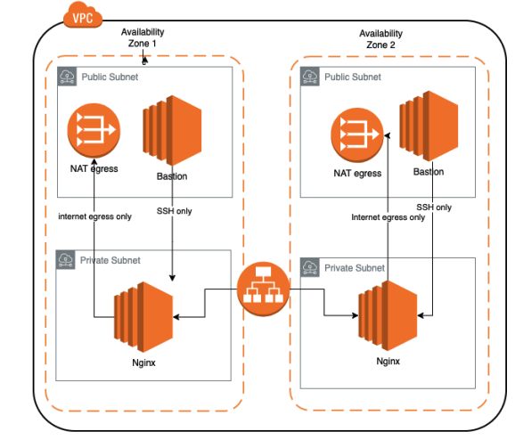

# scaling-rotary-phone

This repository contains Infrastructure as Code (IaC) to deploy an architecture on Amazon Web Services (AWS). It uses HCP Terraform and HashiCorp's GitHub Actions to create a complete workflow that deploys within an HCP Terraform workspace.

1.  Generate a plan for every commit to a pull request branch, which you can review in HCP Terraform.
2.  Apply the configuration when you update the main branch.

After configuring the GitHub Action, you will create and merge a pull request to test the workflow.

## Architecture

The project implements the following architecture:

### Infrastructure Component Description

The architecture is based on two main types of EC2 instances, each with a specific purpose and security configuration to create a robust and secure layered infrastructure.

#### 1. Application Servers (Nginx)

These instances are the core of the web application. They are deployed in private subnets to protect them from direct internet access and are managed by an Auto Scaling Group to ensure high availability.

* **a. Egress-Only Internet Access:** The instances have no public IP, and all their outbound internet traffic (e.g., to download software updates) is routed exclusively through a NAT Gateway.
* **b. Instance Type:** The `t3.small` instance type is used, offering a suitable balance of CPU performance and memory.
* **c. Secure SSH Access:** Administrative access via SSH is strictly controlled. Inbound traffic is only allowed on port `2444` and exclusively from the Bastion hosts' security group.
* **d. Operating System Image:** The instances are launched using the latest official Ubuntu Server AMI.
* **e. IP Addressing:** No public IP is assigned, improving the security posture.
* **f. Application Exposure:** The application is accessible to end-users only through an Application Load Balancer (ALB).
* **g. Software and Content:** Each instance automatically installs and runs the Nginx web server and serves a custom HTML page with the text "Hello from instance {instance ID}".
* **h. Key Management:** SSH access is managed using a dedicated EC2 KeyPair.

#### 2. Bastion Hosts

Bastion hosts act as the single secure gateway to the infrastructure, located in the public subnets.

* **a. Static Public Access:** Each Bastion host is associated with an Elastic IP, providing a static and predictable public IP address.
* **b. Instance Type:** The `t3.small` instance type is used.
* **c. Controlled SSH Access:** SSH access is enabled on the non-standard port `2422` and is restricted to a predefined set of IP addresses.
* **d. Operating System Image:** They use the latest official Ubuntu Server AMI.
* **e. Segregated Key Management:** Access is managed with an exclusive EC2 KeyPair for the bastions, which is different from the one used for the application servers to enhance security.

### Kubernetes Deployment and Monitoring (Exercise 2)

A complete ecosystem for container orchestration, delivery, and monitoring is deployed on top of the base infrastructure.

* **1. Kubernetes Cluster (EKS):** An Amazon EKS cluster is provisioned with a managed node group consisting of 2 `t3.medium` instances.
* **2. Ingress Controller:** The Nginx Ingress Controller is installed using a Helm v3 chart, managed via Terraform.
* **3. Containerized Application:** A simple web application based on an Nginx image is created to display the text "Hello Grainchain". It is made accessible from the internet via a public address managed by the Ingress Controller.
* **4. Dockerfile:** A `Dockerfile` is defined to build a lightweight and efficient container image for the application using an Nginx Alpine base image.
* **5. Continuous Integration (GitHub Actions):** A CI/CD pipeline is configured using GitHub Actions. This pipeline automatically builds the application's Docker image on every push and uploads it to a public Docker Hub repository.
* **6. Helm Chart Packaging:** A custom Helm chart is developed for the application, packaging all necessary Kubernetes resources (`Deployment`, `Service`, `Ingress`) for consistent and versioned deployments.
* **7. Continuous Deployment (GitHub Actions):** The GitHub Actions pipeline is updated with a new deployment job. This job uses the Helm chart to deploy the application to the EKS cluster. The deployment is restricted to run only on the `main` branch.
* **8. Monitoring with Prometheus and Grafana:**
    A full monitoring stack is deployed to the cluster by installing the `kube-prometheus-stack` chart, which includes Prometheus for metrics collection and Grafana for visualization.
    * **a. Datasource:** The chart installation automatically configures a datasource in Grafana that points to the deployed Prometheus instance.
    * **b. Node Dashboard:** A pre-configured dashboard is imported into Grafana to provide detailed metrics about the EKS cluster nodes (CPU, memory, disk, network).
    * **c. Application Dashboard:** A custom dashboard is created in Grafana to visualize key time-series data for the Nginx application, such as memory usage, CPU load, and network traffic.

  
📜 **Automate Terraform with Github Actions**

Follow this tutorial to setup github and hashicorp
https://developer.hashicorp.com/terraform/tutorials/automation/github-actions

